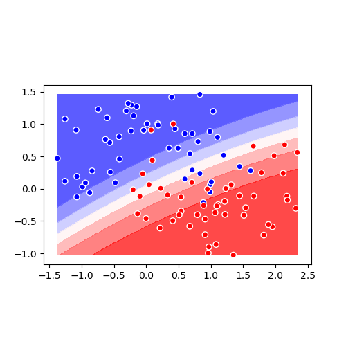

# dataskell



Needed things
---
  * [Nix](https://nixos.org/nix/)

Quick start
---
```
$ nix-shell
[nix-shell:path/to/dataskell]$ ./test lint
[nix-shell:path/to/dataskell]$ ./main
scripts/data.py unknown argument, valid arguments: blobs|circles|moons
[nix-shell:path/to/dataskell]$ ./main moons
```
